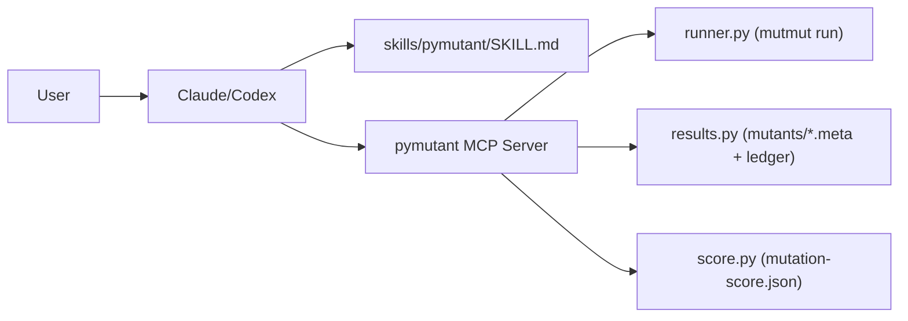
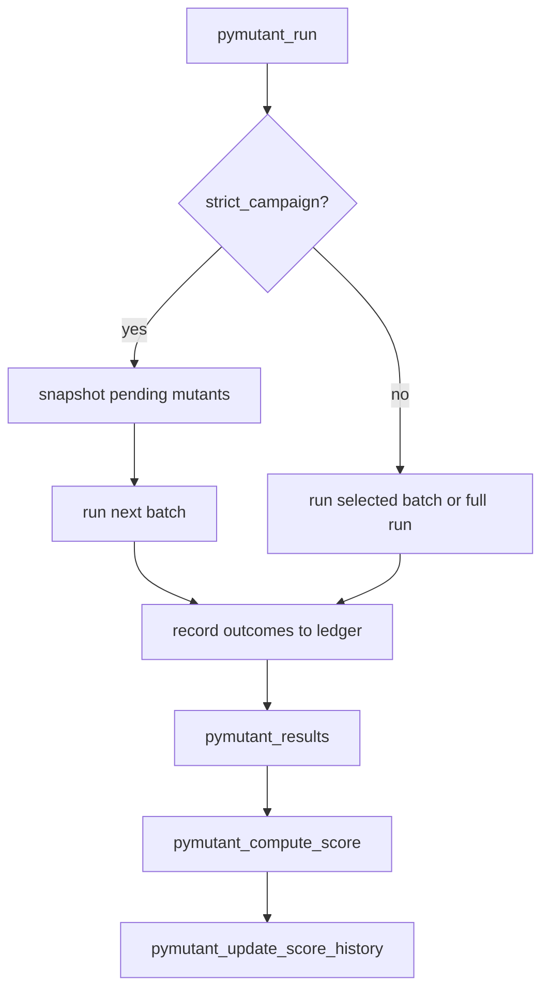

# pymutant — Claude Code Plugin

A globally-installed Claude Code plugin that makes mutation testing with [mutmut](https://mutmut.readthedocs.io/) a first-class workflow. The plugin bundles a Python server (FastMCP) that exposes structured tools for running mutations, reading results, computing scores, and tracking score history.

## Prerequisites

- Python 3.11+
- [uv](https://docs.astral.sh/uv/) (for isolated server venv)
- `mutmut >= 3.5.0` installed in the **target project** (`uv add mutmut --dev`)
- `pytest` in the target project

## Tooling Policy

- This repository supports `uv` only.
- `pip` workflows are not supported for development, CI, or release tasks.

## Installation

```bash
# Option 1: Install via Claude Code plugin system
claude plugin install ./pymutant

# Option 2: Copy directly
cp -r pymutant ~/.claude/plugins/
```

After installing, restart Claude Code or reload plugins.

## Commands

### `/mutation-run [paths] [--no-rerun] [--max-children N]`

Full end-to-end mutation testing workflow:
1. Run `mutmut run` on your project (skip with `--no-rerun` to use existing results)
2. Compute and display mutation score
3. Show all surviving mutants with diffs
4. Write pytest functions to kill each survivor
5. Save score snapshot to `mutation-score.json`

### `/mutation-analyze [file_filter]`

Analyze existing results without re-running:
1. Load results from last run
2. Show score and survivor breakdown
3. Suggest (but don't write) killing tests
4. Display score trend if history exists

## MCP Tools

The `pymutant` server exposes these tools to Claude:

| Tool | Purpose |
|------|---------|
| `pymutant_run` | Shell out to `mutmut run` |
| `pymutant_results` | Read mutant status from `mutants/*.meta` |
| `pymutant_show_diff` | Return unified diff for one mutant |
| `pymutant_compute_score` | Compute killed/(killed+survived+timeout+segfault) (`crash` kept as alias) |
| `pymutant_surviving_mutants` | All survivors with diffs, grouped by file |
| `pymutant_update_score_history` | Append score to `mutation-score.json` |
| `pymutant_score_history` | Load full score history |
| `pymutant_ledger_status` | Show ledger + strict-campaign progress state |
| `pymutant_reset_campaign` | Reset strict-campaign state (optionally clear ledger) |

## Score History

After each run, scores are appended to `mutation-score.json` in the project root:

```json
{
  "history": [
    {
      "timestamp": "2026-03-07T14:51:00",
      "score": 0.78,
      "killed": 45,
      "survived": 13,
      "no_tests": 2,
      "timeout": 0,
      "segfault": 0,
      "total": 60,
      "label": "after adding auth tests"
    }
  ]
}
```

## Architecture





The MCP server inherits the current working directory from Claude Code, so all paths are relative to the project you're working in.

## Docs

- `docs/tool-contracts.md`: MCP tool names, contract, and error payload shape.
- `docs/reporting-artifacts.md`: CI artifacts and the files they contain.
- `docs/architecture.md`: architecture decisions and mutation run flow.

## Skill Auto-Activation

The skill in `skills/pymutant/SKILL.md` auto-activates when you mention:
- "mutation test", "mutant", "mutation score"
- "surviving mutant", "killed mutant"
- "test quality score", "mutmut"
- "test coverage gap"

## Target Project Setup

Add to the project's `pyproject.toml`:

```toml
[tool.mutmut]
paths_to_mutate = ["src/pymutant/", "src/repo_verify/"]
tests_dir = ["tests/"]
```

For this repository, `src/pymutant` is a symlink to `server/src/pymutant` so mutmut keys match runtime module names:

```bash
ln -s ../server/src/pymutant src/pymutant
```

## Development

```bash
uv sync
uv run verify                   # ruff + mypy + bandit + pytest (100% branch coverage)
uv run benchmark throughput     # deterministic runtime/no-op regression benchmark
# uv run benchmark quality      # mutation quality gate (long-running)
uv run pre-commit install
uv run pre-commit run --all-files

cd server && uv run python -m pymutant   # starts pymutant server on stdio
```

Pre-commit CQ stack includes:
- `detect-secrets` (baseline-backed secret scanning)
- Ruff lint/format
- REUSE license compliance + SPDX checks
- codespell
- mypy + ty
- bandit + pip-audit
- xenon complexity + vulture dead-code checks
- `verify` aggregate gate
- manual hooks: `mutation-gate`, `performance-smoke`

### Property/Fuzz Test Profiles

Hypothesis property tests are part of the default suite.
- Local default: `HYPOTHESIS_PROFILE=dev` (`max_examples=200`)
- CI default: `HYPOTHESIS_PROFILE=ci` (`max_examples=80`)

Override explicitly when needed:

```bash
HYPOTHESIS_PROFILE=ci uv run pytest -q
HYPOTHESIS_PROFILE=dev uv run pytest -q
```

## MCP Batching Behavior

`pymutant_run` now batches by default when prior results exist:
- If `mutants/*.meta` contains `not_checked` mutants, the tool runs only the next batch.
- Default batch size is `10` mutants per call.
- Default batch parallelism is `--max-children 2` (unless you pass `max_children`).
- Override via `PYMUTANT_BATCH_SIZE` (for example `export PYMUTANT_BATCH_SIZE=20`).
- When passing explicit `paths`/selectors to `pymutant_run`, use mutant names (for example `pymutant.score.x_compute_score__mutmut_10`), not source file paths.

Calibrated on this repo:
- `batch_size=10`, `max_children=2` is the best balance of throughput and stability.
- Larger batches and higher concurrency were more likely to trigger flaky/segfault runs.
- mutmut pytest runs disable cacheprovider (`-p no:cacheprovider`) to avoid cross-platform `WindowsPath` cache crashes.

### Strict Campaign Mode

Use `pymutant_run(strict_campaign=true)` when mutmut metadata churn causes re-queued mutants.
- On first call, pymutant snapshots pending mutant IDs to `.pymutant-strict-campaign.json`.
- Each call processes only the next batch from that fixed snapshot.
- Progress is deterministic via `campaign_attempted` and `remaining_not_checked`.
- Stale selectors are quarantined in `campaign_stale` instead of triggering unfiltered fallback.

### Outcome Ledger

`pymutant` now writes an append-only mutation ledger at `.pymutant-ledger.json`.
- One event is appended per processed batch/selector run.
- Per-mutant outcomes are captured from mutmut stdout result lines (with meta fallback).
- `pymutant_results` and `pymutant_compute_score` use ledger-resolved statuses when available, so prior terminal outcomes remain stable even if mutmut rewrites `.meta` entries later.

## CI and Local CI

GitHub Actions runs `.github/workflows/ci.yml` with these benchmark-gated jobs:
- `verify`: quality + tests + coverage gate
  - emits `bandit-report` artifact (`dist/bandit-report.json`) for audit traceability
- `mutation_benchmark_throughput` (push/PR/schedule/manual):
  - deterministic strict-campaign stale-selector pass
  - asserts follow-up no-op call behavior (`strict campaign complete; nothing to run`)
  - enforces runtime budgets from `.ci/benchmark-baseline.json`
  - uploads `benchmark-throughput` artifact (`dist/benchmark-throughput.json`)
- `mutation_benchmark_quality` (schedule/manual):
  - strict-campaign-first mutation pass with interruption recovery (`kill_stuck_mutmut`)
  - enforces score floor and failure budgets (`timeout`, `segfault`, duration, iteration cap, minimum checked mutants)
  - accepts interrupted runs only when mutation progress is recorded and budgets are still satisfied
  - uploads `benchmark-quality` / `release-benchmark-quality` artifact (`dist/benchmark-quality.json`)
- `build`: build both root and server distributions, run `twine check`, generate `SHA256SUMS`, and verify checksums
  - normalizes artifacts to `pymutant*` files only before metadata/checksum validation
  - uploads release artifact bundle (`release-dist`)

Optional in CI: if `GPG_PRIVATE_KEY` and `GPG_PASSPHRASE` secrets are set, the workflow signs `dist/SHA256SUMS` to produce `dist/SHA256SUMS.asc`.

### Benchmark Baseline

Benchmark thresholds are versioned in `.ci/benchmark-baseline.json` and treated as gates:
- `quality.min_score`: `0.40`
- `quality.min_checked_mutants`: `10`
- `quality.max_timeout`: `3`
- `quality.max_segfault`: `500`
- `quality.max_duration_seconds`: `7200`
- `throughput.max_first_call_seconds`: `160`
- `throughput.max_noop_call_seconds`: `4`
- `throughput.max_total_seconds`: `165`

For stricter enforcement, lower failure budgets and raise `min_score` incrementally as the codebase improves.

### Release Tag Gate

Tag pushes (`v*`) run `.github/workflows/release-readiness.yml`, which requires:
1. `uv run verify` to pass.
2. `uv run benchmark quality` to pass against `.ci/benchmark-baseline.json`.
3. Build + twine + checksum validation with `pymutant*` artifacts only.

Run the same workflow locally with `act`:

```bash
export DOCKER_HOST=unix:///Users/tim/.colima/default/docker.sock #4.
act push -W .github/workflows/ci.yml --container-architecture linux/amd64 --container-daemon-socket -
```

`--container-daemon-socket -` avoids bind-mounting the Docker socket path inside the container when using Colima.
