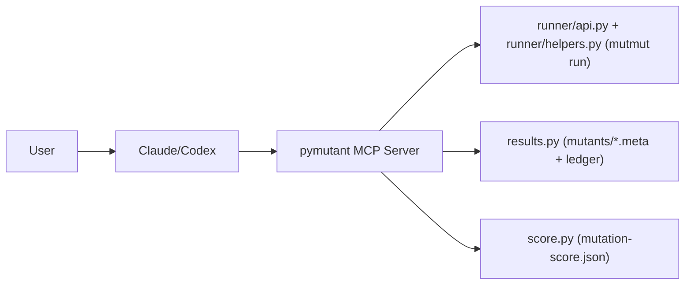
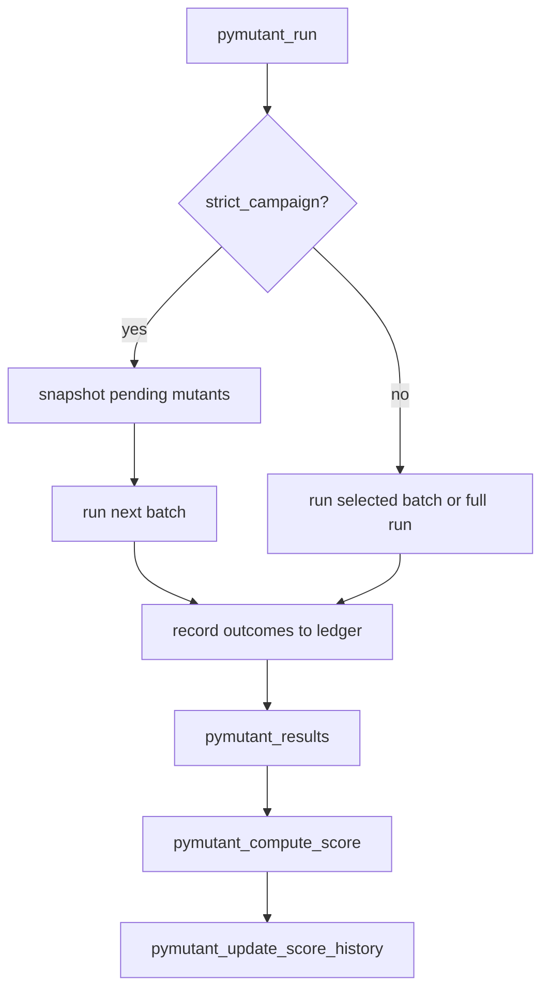

# pymutant — MCP Server for Mutation Testing

An MCP server (FastMCP, stdio) that makes mutation testing with [mutmut](https://mutmut.readthedocs.io/) a first-class workflow. Exposes structured tools for running mutations, reading results, computing scores, and tracking score history.

## Prerequisites

- Python 3.11+
- [uv](https://docs.astral.sh/uv/) (for isolated server venv)
- `mutmut >= 3.5.0` installed in the **target project** (`uv add mutmut --dev`)
- `pytest` in the target project

## Tooling Policy

- This repository supports `uv` only.
- `pip` workflows are not supported for development, CI, or release tasks.

## Operational Contract

`pymutant` is a controller around `mutmut`, not a mutation engine.

- Runtime parity: execute in the target project's environment (same Python/deps/shims used by CI).
- Deterministic outputs: all MCP tools return structured JSON envelopes and schema-versioned artifacts.
- Failure separation: mutation-quality outcomes (`killed/survived/no_tests`) are distinct from execution instability (`timeout/segfault/interruption/tooling errors`).
- Policy-first gating: enforce absolute floors and baseline-drop policies via profiles and policy checks.

## Installation

### Claude Code

```bash
claude mcp add pymutant -- uvx pymutant
```

Or add to your project's `.mcp.json`:

```json
{
  "mcpServers": {
    "pymutant": {
      "command": "uvx",
      "args": ["pymutant"]
    }
  }
}
```

### Claude Desktop

Add to `claude_desktop_config.json`:

```json
{
  "mcpServers": {
    "pymutant": {
      "command": "uvx",
      "args": ["pymutant"]
    }
  }
}
```

### Local development

```bash
uv run pymutant --project-root .
```

## Commands

Commands live in `.claude/commands/` and are discoverable by Claude Code.

### `/mutation-run [paths] [--no-rerun] [--max-children N]`

Full end-to-end mutation testing workflow:

1. Run `mutmut run` on your project (skip with `--no-rerun` to use existing results)
1. Compute and display mutation score
1. Show all surviving mutants with diffs
1. Write pytest functions to kill each survivor
1. Save score snapshot to `mutation-score.json`

### `/mutation-analyze [file_filter]`

Analyze existing results without re-running:

1. Load results from last run
1. Show score and survivor breakdown
1. Suggest (but don't write) killing tests
1. Display score trend if history exists

## MCP Tools

The `pymutant` server exposes these tools to Claude:

| Tool | Purpose |
|------|---------|
| `pymutant_run` | Shell out to `mutmut run` (supports `changed_only` + `base_ref`) |
| `pymutant_results` | Read mutant status from `mutants/*.meta` |
| `pymutant_show_diff` | Return unified diff for one mutant |
| `pymutant_compute_score` | Compute killed/(killed+survived+timeout+segfault) (`crash` kept as alias) |
| `pymutant_surviving_mutants` | All survivors with diffs, grouped by file |
| `pymutant_update_score_history` | Append score to `mutation-score.json` |
| `pymutant_score_history` | Load full score history |
| `pymutant_ledger_status` | Show ledger + strict-campaign progress state |
| `pymutant_reset_campaign` | Reset strict-campaign state (optionally clear ledger) |
| `pymutant_rank_survivors` | Rank survivors by impact/frequency/churn priority |
| `pymutant_explain_failure` | Classify failure source and suggest remediation |
| `pymutant_policy_check` | Evaluate policy gates (baseline-drop + absolute floor) |
| `pymutant_trend_report` | Mutation drift/regression summary from score history |
| `pymutant_suggest_pytest_patch` | Generate pytest patch suggestion (optional `apply=true`) |
| `pymutant_render_report` | Generate HTML report bundle under `dist/` |
| `pymutant_set_project_root` | Set process-local project root at runtime for this MCP process |
| `pymutant_baseline_status` | Show execution-baseline validity, drift reasons, and fingerprint |
| `pymutant_baseline_refresh` | Reset runtime mutation state and write fresh execution baseline |

All tools return the same response envelope:

```json
{
  "ok": true,
  "data": {},
  "error": null,
  "schema_version": "1.0",
  "generated_at": "2026-03-09T14:00:00+00:00"
}
```

Mutation run/status/score payloads also include a `baseline` block:

- `valid`
- `reasons`
- `fingerprint_id`
- `auto_reset_applied`

## Score History

After each run, scores are appended to `mutation-score.json` in the project root:

```json
{
  "history": [
    {
      "timestamp": "2026-03-07T14:51:00",
      "score": 0.78,
      "killed": 45,
      "survived": 13,
      "no_tests": 2,
      "timeout": 0,
      "segfault": 0,
      "total": 60,
      "label": "after adding auth tests"
    }
  ]
}
```

## Architecture





Project root resolution is runtime-only and non-sticky:

- `PYMUTANT_PROJECT_ROOT` (preferred, explicit)
- process `cwd` (fallback)

You can also set root dynamically at launch:

- `pymutant --project-root /abs/path/to/repo`
- `pymutant --project-root .` (resolved relative to launch cwd)

## Docs

- [`docs/tool-contracts.md`](https://github.com/provide-io/pymutant-mcp/blob/main/docs/tool-contracts.md): MCP tool names, contract, and error payload shape.
- [`docs/reporting-artifacts.md`](https://github.com/provide-io/pymutant-mcp/blob/main/docs/reporting-artifacts.md): CI artifacts and the files they contain.
- [`docs/architecture.md`](https://github.com/provide-io/pymutant-mcp/blob/main/docs/architecture.md): architecture decisions and mutation run flow.

## Target Project Setup

Add to the project's `pyproject.toml`:

```toml
[tool.mutmut]
paths_to_mutate = ["src/mypackage/"]
tests_dir = ["tests/"]
```

## Development

```bash
uv sync
uv run verify                   # governance + quality gate (ruff, max-loc, SPDX, mypy, bandit, docs, schemas, pytest 100%)
uv run python scripts/validate_repo_schemas.py
uv run mutation-sweep --max-rounds 4 --json-out dist/mutation-gate.json
uv run benchmark throughput     # deterministic runtime/no-op regression benchmark
# uv run benchmark quality      # mutation quality gate (long-running)
uv run mcp-smoke --project-root . --base-ref HEAD
uv run pre-commit install
uv run pre-commit run --all-files

uv run pymutant --project-root .   # starts pymutant server on stdio
```

Pre-commit CQ stack includes:

- `detect-secrets` (baseline-backed secret scanning)
- Ruff lint/format
- max LOC guard (`scripts/check_max_loc.py`)
- SPDX header compliance check (`scripts/check_spdx_headers.py`)
- REUSE license compliance + SPDX checks
- codespell
- mypy + ty
- bandit + pip-audit
- xenon complexity + vulture dead-code checks
- `verify` aggregate gate
- manual hooks: `mutation-gate`, `performance-smoke`
  - `mutation-sweep` manual hook enforces zero survivors for local campaign runs

### Property/Fuzz Test Profiles

Hypothesis property tests are part of the default suite.

- Local default: `HYPOTHESIS_PROFILE=dev` (`max_examples=200`)
- CI default: `HYPOTHESIS_PROFILE=ci` (`max_examples=80`)

Override explicitly when needed:

```bash
HYPOTHESIS_PROFILE=ci uv run pytest -q
HYPOTHESIS_PROFILE=dev uv run pytest -q
```

## MCP Batching Behavior

`pymutant_run` now batches by default when prior results exist:

- If `mutants/*.meta` contains `not_checked` mutants, the tool runs only the next batch.
- Default batch size is `10` mutants per call.
- Default batch parallelism is `--max-children 2` (unless you pass `max_children`).
- Override via `PYMUTANT_BATCH_SIZE` (for example `export PYMUTANT_BATCH_SIZE=20`).
- When passing explicit `paths`/selectors to `pymutant_run`, use mutant names (for example `pymutant.score.x_compute_score__mutmut_10`), not source file paths.

Calibrated on this repo:

- `batch_size=10`, `max_children=2` is the best balance of throughput and stability.
- Larger batches and higher concurrency were more likely to trigger flaky/segfault runs.
- mutmut pytest runs disable cacheprovider (`-p no:cacheprovider`) to avoid cross-platform `WindowsPath` cache crashes.

### Changed-Only Mode

Use `pymutant_run(changed_only=true)` to target only changed Python files from git.

- Default diff target is `HEAD` (includes current local changes).
- Optional `base_ref` (for example `origin/main`) uses `base_ref...HEAD`.
- Untracked Python files are included when they are under configured `paths_to_mutate`.
- If no changed Python files match mutation roots, the tool returns a no-op success response.
- If changed selectors do not map to active mutants, the tool returns a no-op success response (`no matching mutants for changed selectors`) rather than a tooling error.

### Strict Campaign Mode

Use `pymutant_run(strict_campaign=true)` when mutmut metadata churn causes re-queued mutants.

- On first call, pymutant snapshots pending mutant IDs to `.pymutant-strict-campaign.json`.
- Each call processes only the next batch from that fixed snapshot.
- Progress is deterministic via `campaign_attempted` and `remaining_not_checked`.
- Stale selectors are quarantined in `campaign_stale`, excluded from `remaining_not_checked`, and no longer re-queued.

### Baseline Lifecycle

`pymutant` tracks runtime execution baseline state in `.pymutant-state/baseline.json`.

- Baseline fingerprint captures git head, Python/mutmut versions, resolved mutation/test roots, profile hash, and command mode.
- On `pymutant_run`, drift is auto-detected and runtime mutation state is reset before continuing.
- Use `pymutant_baseline_status` to inspect validity and drift reasons.
- Use `pymutant_baseline_refresh` to force reset + re-baseline.

### Outcome Ledger

`pymutant` now writes an append-only mutation ledger at `.pymutant-ledger.json`.

- One event is appended per processed batch/selector run.
- Per-mutant outcomes are captured from mutmut stdout result lines (with meta fallback).
- `pymutant_results` and `pymutant_compute_score` use ledger-resolved statuses when available, so prior terminal outcomes remain stable even if mutmut rewrites `.meta` entries later.

## CI and Local CI

GitHub Actions runs `.github/workflows/ci.yml` with these benchmark-gated jobs:

- `verify`: quality + tests + coverage gate
  - emits `bandit-report` artifact (`dist/bandit-report.json`) for audit traceability
  - runs `uv run mcp-smoke --project-root . --base-ref HEAD` to validate MCP root/setup/run path
- `mutation_benchmark_throughput` (push/PR/schedule/manual):
  - deterministic strict-campaign stale-selector pass
  - asserts follow-up no-op call behavior (`strict campaign complete; nothing to run`)
  - enforces runtime budgets from `.ci/benchmark-baseline.json`
  - validates `dist/benchmark-throughput.json` against `schemas/benchmark-throughput.schema.json`
  - uploads `benchmark-throughput` artifact (`dist/benchmark-throughput.json`)
- `mutation_zero_survivors` (PR + push):
  - runs changed-only mutation gate:
    - PR: `--base-ref origin/<base_branch>`
    - push: `--base-ref <before_sha>` (or full gate on first push with no before SHA)
  - fails CI when survivors remain after configured rounds
  - uploads `mutation-gate` artifact (`dist/mutation-gate.json`)
- `mutation_benchmark_quality` (schedule/manual):
  - strict-campaign-first mutation pass with interruption recovery (`kill_stuck_mutmut`)
  - classifies execution collapse as `tooling_error` (separate from test quality score)
  - enforces score floor and failure budgets (`timeout`, `segfault`, duration, iteration cap, minimum checked mutants)
  - accepts interrupted runs only when mutation progress is recorded and budgets are still satisfied
  - validates `dist/benchmark-quality.json` against `schemas/benchmark-quality.schema.json`
  - uploads `benchmark-quality` / `release-benchmark-quality` artifact (`dist/benchmark-quality.json`)
- `build`: build distribution, run `twine check`, generate `SHA256SUMS`, and verify checksums

Optional in CI: if `GPG_PRIVATE_KEY` and `GPG_PASSPHRASE` secrets are set, the workflow signs `dist/SHA256SUMS` to produce `dist/SHA256SUMS.asc`.

### Benchmark Baseline

Benchmark thresholds are versioned in `.ci/benchmark-baseline.json` and treated as gates:

- `quality.min_score`: `0.385`
- `quality.min_checked_mutants`: `10`
- `quality.max_timeout`: `3`
- `quality.max_segfault`: `500`
- `quality.max_duration_seconds`: `7200`
- `throughput.max_first_call_seconds`: `160`
- `throughput.max_noop_call_seconds`: `4`
- `throughput.max_total_seconds`: `165`

For stricter enforcement, lower failure budgets and raise `min_score` incrementally as the codebase improves.

### Release Tag Gate

Tag pushes (`v*`) run `.github/workflows/release-readiness.yml`, which requires:

1. `uv run verify` to pass.
1. `uv run benchmark quality` to pass against `.ci/benchmark-baseline.json`.
1. Build + twine + checksum validation.

Run the same workflow locally with `act`:

```bash
export DOCKER_HOST=unix://${HOME}/.colima/default/docker.sock
act push -W .github/workflows/ci.yml --container-architecture linux/amd64 --container-daemon-socket -
```

`--container-daemon-socket -` avoids bind-mounting the Docker socket path inside the container when using Colima.

When running under `act` (`ACT=true`), this workflow executes the `verify` job and skips mutation benchmark/build jobs to avoid local QEMU timing variance and PR base-ref fetch issues.

Operator procedures for mutation campaigns, stuck-process recovery, and strict campaign progress are documented in [`docs/operator-runbook.md`](https://github.com/provide-io/pymutant-mcp/blob/main/docs/operator-runbook.md).
